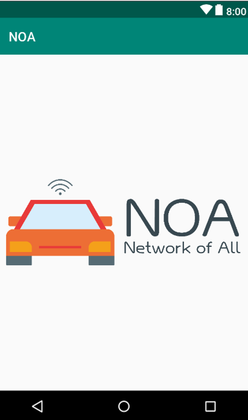

# 시작장애인을 위한 자율주행 안내로봇 [Iron Dog]
 

## 프로젝트 요약
> 2019.01. - 2019.09.  
 
> **Android Developer**   
> **Back-End Developer**   
* 🏅 2019 인하대학교 공학을 품다 최우수상
* 시각장애인이 길을 찾아갈 수 있도록 하기 위해 기획하였습니다.
* ROS을 이용하여 자율주행을 구현하였습니다.
* 로봇과 연결된 모바일 앱은 모두 음성으로 이용할 수 있게 하였습니다.

## 담당 역할
### Android
   
* 카카오 음성합성 API를 이용하여 사용자에게 안내 음성 전달
* 카카오 음성인식 API를 이용하여 사용자의 목적지 및 응답 인식
* 목적지 설정/수정/취소/도착 기능 로직 구현
* 사용자의 목적지 좌표를 ROS master에게 topic으로 전달
* 로봇 상태값에 따른 안내 음성 출력

### BE

  

* 아파치 서버에 사용자의 목적지 저장
* ROS Node를 생성하여 master에게 해당 목적지의 좌표 토픽 publishing
* 로봇에게 상태값을 subscribing
    - 계단, 신호등이 있는 경우
    - 신호등의 초록불이 깜빡이고 남은 시간이 나오는 경우

* * *
### 참조
카카오 뉴톤/톡 : [뉴톤/톡](https://developers.kakao.com/docs/android/speech#%EC%9D%8C%EC%84%B1-%EC%9D%B8%EC%8B%9D) 
